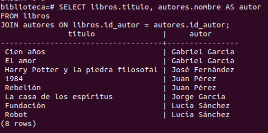
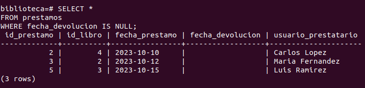
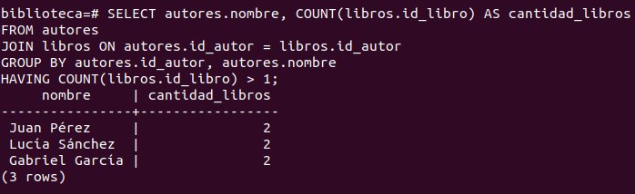
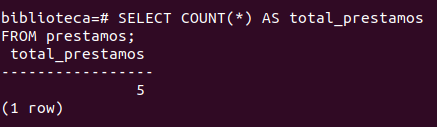
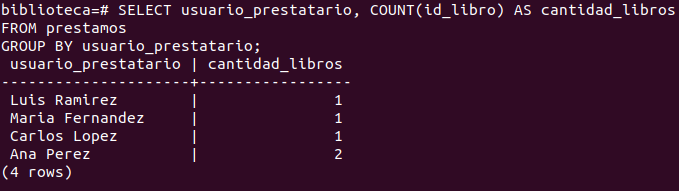
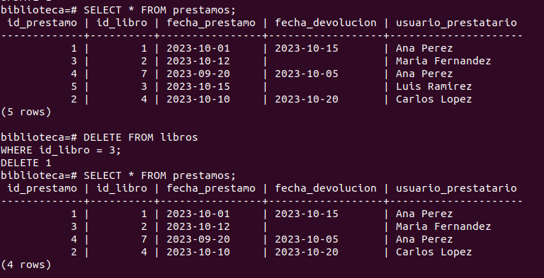
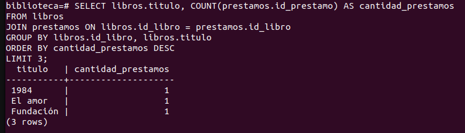

# ADBD
## P1 - Conceptos fundamentales de PostgreSQL
### 1. Creación Creación de la base de datos
- Crear una base de datos llamada biblioteca.
```sql
CREATE DATABASE biblioteca;
```
Y nos devuelve un mensaje de confirmación: `CREATE DATABASE`.

### 2. Creación de usuarios
- Crear dos usuarios:
  - admin_biblio con permisos de administrador sobre la base de datos.
  ```sql  
  CREATE USER admin_biblio WITH PASSWORD 'admin123';
  ```
  Y me devuelve un mensaje de confirmación: `CREATE ROLE`.

  - usuario_biblio con permisos solo de lectura.
  ```sql
  CREATE USER usuario_biblio WITH PASSWORD 'user123';
  ```
  Y me devuelve un mensaje de confirmación: `CREATE ROLE`

- Crear un rol llamado lectores con permisos únicamente de consulta sobre todas las tablas de la base de datos.
  ```sql
  CREATE ROLE lectores;
  ```
  Y me devuelve un mensaje de confirmación: `CREATE ROLE`.

  Para configurar bien los permisos de este rol, se debe ejecutar la siguiente sentencia:
  ```sql
  GRANT USAGE ON SCHEMA public TO lectores;
  GRANT SELECT ON ALL TABLES IN SCHEMA public TO lectores;
  ALTER DEFAULT PRIVILEGES IN SCHEMA public GRANT SELECT ON TABLES TO lectores; 
  ````
  Que nos devuelme como mensaje de confirmación `GRANT` y `ALTER DEFAULT PRIVILEGES`.
  
- Asignar el usuario usuario_biblio a este rol.
```sql
GRANT lectores TO usuario_biblio;
```
Y me devuelve un mensaje de confirmación: `GRANT`.

- Consultar las tablas del sistema para listar todos los usuarios creados (pg_roles).
```sql
SELECT rolname FROM pg_roles;
```
Que devuelve un listado de todos los usuarios creados en la base de datos en los que aparece correctamente el usuario usuario_biblio y admin_biblio.

- Cambiar la contraseña del usuario usuario_biblio.
```sql
ALTER USER usuario_biblio WITH PASSWORD 'user456';
```
Que devuelve un mensaje de confirmación: `ALTER ROLE`.

- Configurar permisos de tal forma que el usuario usuario_biblio no pueda eliminar registros en ninguna tabla.
```sql
REVOKE DELETE ON ALL TABLES IN SCHEMA public FROM usuario_biblio;
REVOKE DELETE ON ALL TABLES IN SCHEMA public FROM lectores;
```
Que ambos nos devuelve un mensaje de confirmación: `REVOKE`.


### 3. Creación de tablas
- Crear las siguientes tablas con sus respectivas claves primarias:
  - autores(id_autor, nombre, nacionalidad)
  ```sql
  CREATE TABLE autores (
    id_autor SERIAL PRIMARY KEY,
    nombre VARCHAR(100) NOT NULL,
    nacionalidad VARCHAR(50)
  );
  ```

  - libros(id_libro, titulo, año_publicacion, id_autor)
  ```sql
  CREATE TABLE libros (
    id_libro SERIAL PRIMARY KEY,
    titulo VARCHAR(150) NOT NULL,
    año_publicacion INT,
    id_autor INT REFERENCES autores(id_autor) ON DELETE CASCADE
  );
  ```

  - prestamos(id_prestamo, id_libro, fecha_prestamo, fecha_devolucion, usuario_prestatario)
  ```sql
  CREATE TABLE prestamos (
    id_prestamo SERIAL PRIMARY KEY,
    id_libro INT REFERENCES libros(id_libro) ON DELETE CASCADE,
    fecha_prestamo DATE DEFAULT CURRENT_DATE,
    fecha_devolucion DATE,
    usuario_prestatario VARCHAR(100) NOT NULL
  );  
  ```
  La creación de las tres tablas nos devuelve un mensaje de confirmación: `CREATE TABLE`.

- Establecer las claves foráneas correspondientes.
NOTA: Las claves foráneas ya se establecieron en la creación de las tablas, con las sentencias `REFERENCES` y `ON DELETE CASCADE` para mantener la integridad referencial.


### 4. Inserción de datos
- Insertar al menos 5 autores, 8 libros y 5 préstamos de ejemplo.
```sql
-- Insertar autores
INSERT INTO autores (nombre, nacionalidad) VALUES
('Gabriel García', 'Española'),
('José Fernández', 'Chilena'),
('Juan Pérez', 'Británica'),
('Jorge García', 'Británica'),
('Lucía Sánchez', 'Española');  
-- Insertar libros
INSERT INTO libros (titulo, año_publicacion, id_autor) VALUES
('Cien años', 1967, 1),
('El amor', 1985, 1),
('Harry Potter y la piedra filosofal', 1997, 2),
('1984', 1949, 3),
('Rebelión', 1945, 3),
('La casa de los espíritus', 1982, 4),
('Fundación', 1951, 5),
('Robot', 1950, 5);
-- Insertar préstamos
INSERT INTO prestamos (id_libro, fecha_prestamo, fecha_devolucion, usuario_prestatario) VALUES
(1, '2023-10-01', '2023-10-15', 'Ana Perez'),
(4, '2023-10-10', NULL, 'Carlos Lopez'),
(2, '2023-10-12', NULL, 'Maria Fernandez'),
(7, '2023-09-20', '2023-10-05', 'Ana Perez'),
(3, '2023-10-15', NULL, 'Luis Ramirez');
```
Estas inserciones nos devuelven un mensaje de confirmación: `INSERT 0 5`, `INSERT 0 8` y `INSERT 0 5` respectivamente.


### 5. Consultas básicas
- Listar todos los libros con su autor correspondiente.
```sql
SELECT libros.titulo, autores.nombre AS autor
FROM libros
JOIN autores ON libros.id_autor = autores.id_autor;
```
Y nos devuelve un listado con todos los libros y sus autores.


- Mostrar los préstamos que aún no tienen fecha de devolución.
```sql
SELECT *
FROM prestamos
WHERE fecha_devolucion IS NULL;
```


- Obtener los autores que tienen más de un libro registrado.
```sql
SELECT autores.nombre, COUNT(libros.id_libro) AS cantidad_libros
FROM autores
JOIN libros ON autores.id_autor = libros.id_autor
GROUP BY autores.id_autor, autores.nombre
HAVING COUNT(libros.id_libro) > 1;
```


### 6. Consultas con agregación
- Calcular el número total de préstamos realizados.
```sql
SELECT COUNT(*) AS total_prestamos
FROM prestamos;
```


- Obtener el número de libros prestados por cada usuario.
```sql
SELECT usuario_prestatario, COUNT(id_libro) AS cantidad_libros
FROM prestamos
GROUP BY usuario_prestatario;
```


### 7. Modificación de datos
- Actualizar la fecha de devolución de un préstamo pendiente.
```sql
UPDATE prestamos
SET fecha_devolucion = '2023-10-20'
WHERE id_prestamo = 2;
```
Nos devuelve un mensaje de confirmación: `UPDATE 1`.

- Eliminar un libro y comprobar el efecto en la tabla de préstamos (usar ON DELETE CASCADE o justificar el comportamiento).
```sql
DELETE FROM libros
WHERE id_libro = 3;
```
Al eliminar el libro con id_libro = 3, todos los registros de préstamos asociados a ese libro también se eliminarán automáticamente debido a la cláusula `ON DELETE CASCADE`. Lo comprobamos haciendo una consulta para mostrar todos los registros de la tabla de préstamos antes y después de la eliminación.



### 8. Creación de vistas
- Crear una vista llamada vista_libros_prestados que muestre: título del libro, autor y nombre del prestatario.
```sql
CREATE VIEW vista_libros_prestados AS
SELECT libros.titulo, autores.nombre AS autor, prestamos.usuario_prestatario
FROM libros
JOIN autores ON libros.id_autor = autores.id_autor
JOIN prestamos ON libros.id_libro = prestamos.id_libro;
```
Que nos devuelve un mensaje de confirmación: `CREATE VIEW`.

- Conceder permisos de consulta sobre esta vista únicamente a usuario_biblio.
```sql
GRANT SELECT ON vista_libros_prestados TO usuario_biblio;
```
Y nos devuelve un mensaje de confirmación: `GRANT`.

### 9. Funciones y consultas avanzadas
- Crear una función que reciba el nombre de un autor y devuelva todos los libros escritos por él.
```sql
CREATE OR REPLACE FUNCTION obtener_libros_por_autor(nombre_autor VARCHAR)
RETURNS TABLE(titulo VARCHAR, año_publicacion INT) AS $$
BEGIN
    RETURN QUERY
    SELECT libros.titulo, libros.año_publicacion
    FROM libros
    JOIN autores ON libros.id_autor = autores.id_autor
    WHERE autores.nombre = nombre_autor;
END;
$$ LANGUAGE plpgsql;
```
Que nos devuelve un mensaje de confirmación: `CREATE FUNCTION`.

- Crear una consulta que devuelva los tres libros más prestados.
```sql
SELECT libros.titulo, COUNT(prestamos.id_prestamo) AS cantidad_prestamos
FROM libros
JOIN prestamos ON libros.id_libro = prestamos.id_libro
GROUP BY libros.id_libro, libros.titulo
ORDER BY cantidad_prestamos DESC
LIMIT 3;
```



### 10. Exportación e importación de datos
- Exportar el contenido de la tabla libros a un archivo CSV.

```sql
COPY libros TO '/ruta/libros.csv' WITH CSV HEADER;
```

- Importar datos adicionales de autores desde un archivo CSV externo.
```sql
COPY autores(nombre, nacionalidad) FROM '/ruta/autores_adicionales.csv' WITH CSV HEADER;
```

Hacer esto mejor dentro de la interfaz de dbeaver, ya que es más sencillo y rápido. Se puede hacer desde la opción de "Importar datos" y seleccionar el archivo CSV correspondiente. Y la exportación de datos se puede hacer desde la opción de "Exportar datos" y seleccionar el formato CSV.